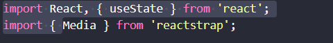

# Atividade da aula09
### aluno:Igor Pereira de Araújo 
### professor: Thiago Nogueira 
### Data:25/11/2024
## inserindo componentes dentro do react

- **import:**   

Essa é a função que importa outros arquivos necessarios para o funcionamento dos componentes inseridos.

- **menu:**  
  

Esse é um componete que chama o menu para o react onde o ele vai chamar um array com as informações requisitas do produto.

- **const:**  
  
Essa função ela vai analisar a lista do array e adaptar um layout para demonstrar a lista dos pratos na interface.

- **return:**  
  
Essa é a parte do codigo que é a parte final do componente que vai renderizar na interface.

